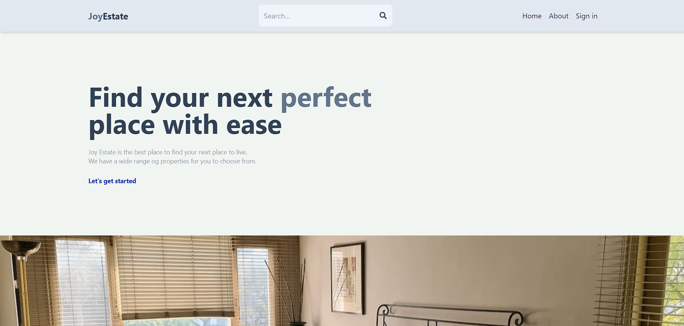
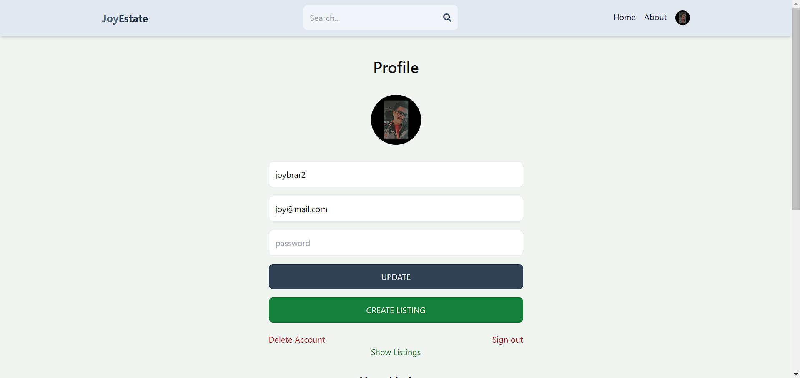
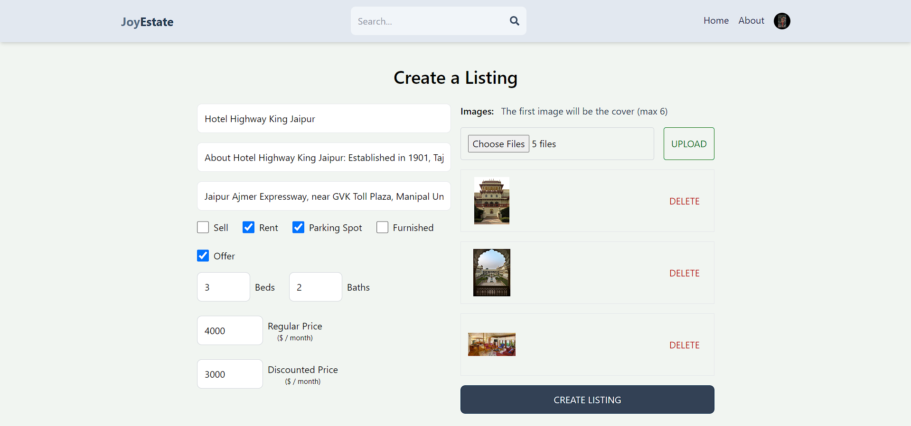

# Joy Estate Marketplace Web App

## Overview

Welcome to the Joy Estate Marketplace web app! This full-stack application is designed to facilitate the buying, selling, and renting of real estate properties. With user-friendly interfaces and robust backend support, this app provides a seamless experience for property seekers and owners alike.

## Features

- **User Authentication:** Secure login and registration with options for Google OAuth.
- **Property Listings:** Browse and search properties for sale or rent with detailed descriptions, photos, and pricing.
- **Property Management:** Users can list new properties, update existing listings, and manage their property portfolio.
- **Advanced Search:** Filter properties by location, price range, property type, and other criteria.
- **Messaging System:** Direct messaging between buyers/renters and property owners for inquiries and negotiations via email.
- **Responsive Design:** Optimized for both desktop and mobile viewing.

## Screenshots

### Home Page


### Property Listing


### Property Details


### Profile Details


### Create your listing


## Tech Stack

### Frontend

- **Framework:** React
- **State Management:** Redux
- **Routing:** React Router
- **Styling:** TailwindCSS
- **API Requests:** Axios

### Backend

- **Server:** Node.js with Express
- **Database:** MongoDB
- **Authentication:** JWT (JSON Web Tokens)
- **File Storage:** Firebase

## Setup and Installation

1. **Clone the repository:**
    ```bash
    git clone https://github.com/JoyBrar2001/mern-estate-app.git
    cd mern-estate-app
    ```

2. **Install dependencies for backend**
    ```bash
    npm install
    ```

3. **Install dependencies for frontend**
    ```bash
    cd client
    npm install
    ```

4. **Create a .env file in the root directory with the following variables**
    ```bash
    MONGO_URI = Your_MongoDB_Database_Key
    JWT_SECRET = Your_JWT_Secret_Key
    ```

5. **Create a .env file in the client directory with the following variables**
    ```bash
    VITE_FIREBASE_API_KEY = Your_FireBase_key
    ```

6. **Start the backend server**
    ```bash
    npm run dev
    ```

7. **In a parallel terminal, start the frontend server**
    ```bash
    cd client
    npm run dev
    ```

## Contribution

Contributions are welcome! Please fork the repository and create a pull request with your changes. Make sure to follow the project's coding guidelines and standards.

## Contact

For questions or feedback, please contact joybrar2001@gmail.com.